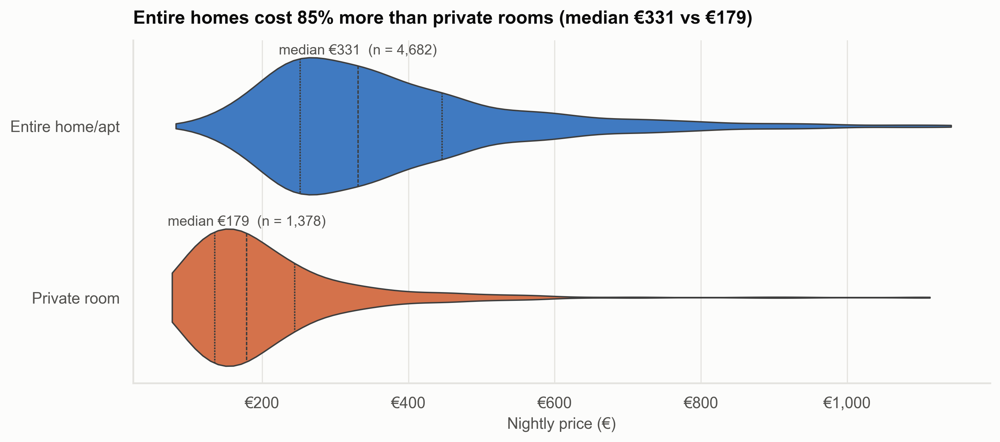
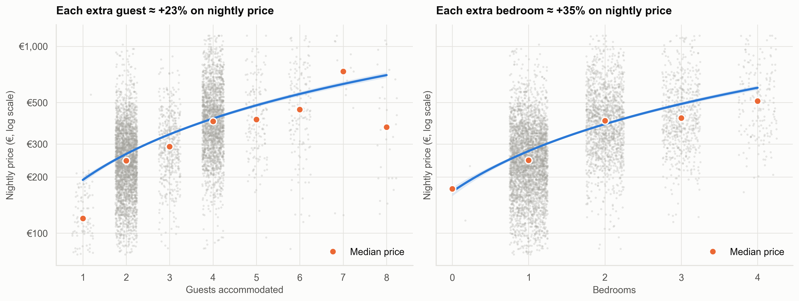
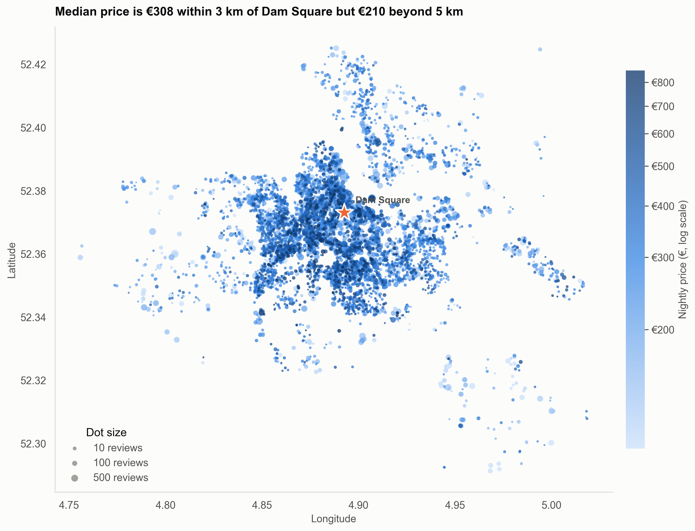
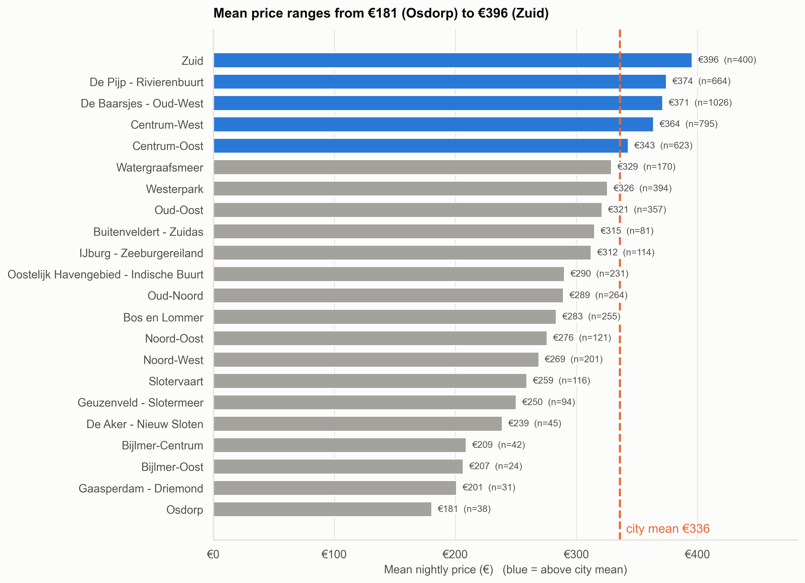
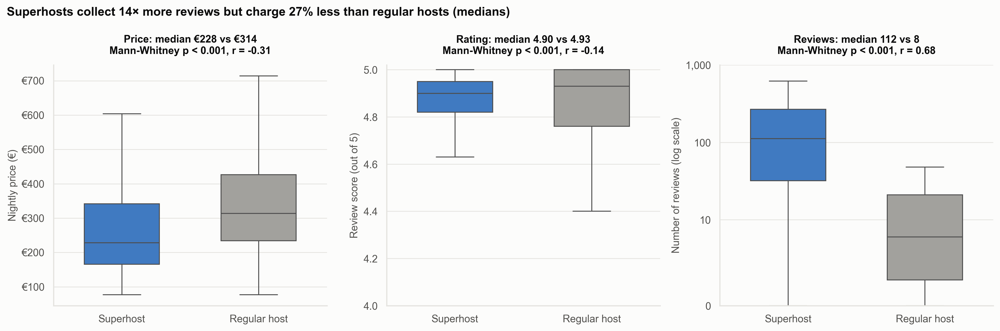
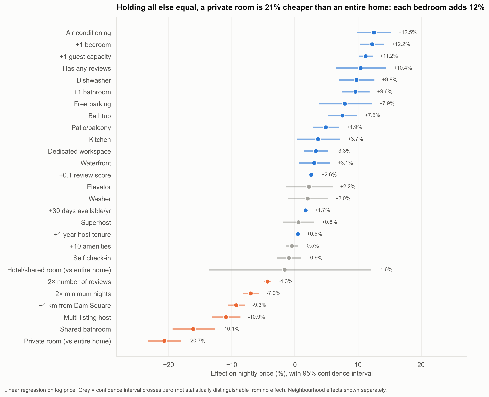
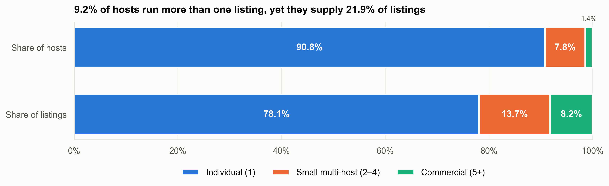
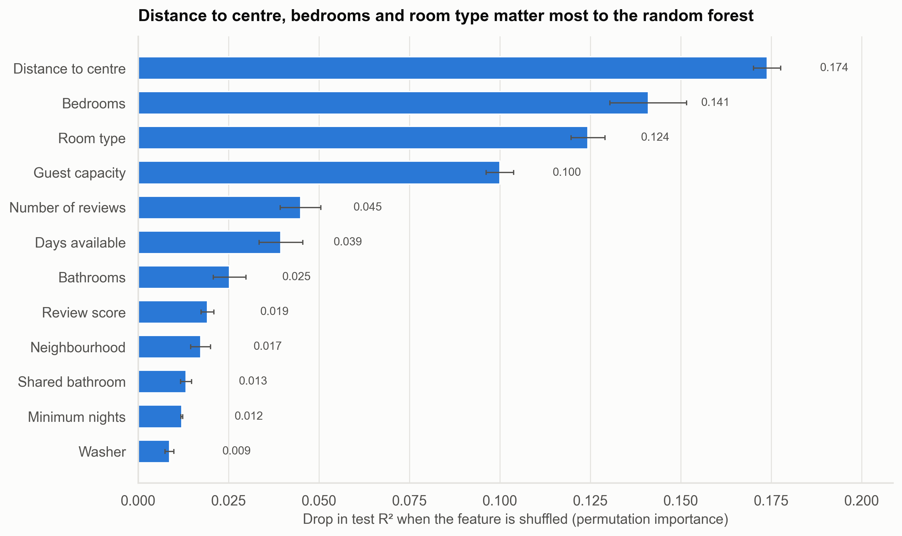
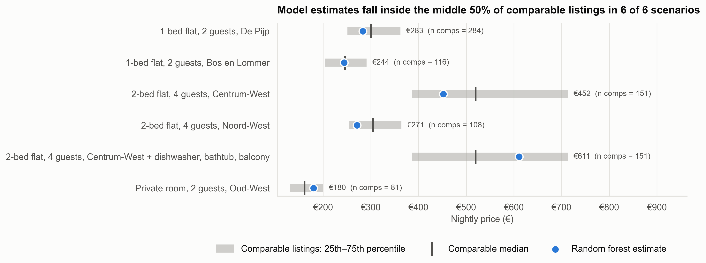

# Airbnb Price Drivers & Market Analysis — Amsterdam

> What drives Airbnb listing prices in Amsterdam, and how should a new host price competitively?

An end-to-end analysis of **6,086 active Amsterdam Airbnb listings** (June 2026), from raw-data cleaning through statistical testing to price modelling. Written for **prospective hosts** deciding what to charge, and **property investors** deciding what kind of property earns the highest nightly rate.

---

## Problem statement

New hosts usually set a price by browsing a few nearby listings. That approach can't tell them *which* features justify a higher price. Is a superhost badge worth more than a dishwasher? Does a canal-ring address beat an extra bedroom? This project answers three questions:

1. **Market:** what does the Amsterdam Airbnb market look like by room type, neighbourhood and location?
2. **Drivers:** which listing characteristics are associated with higher prices, and by how much (in %)?
3. **Pricing:** with everything else held constant, what is each feature worth, and what price should a new listing start at?

## Dataset

| | |
|---|---|
| **Source** | [Inside Airbnb](https://insideairbnb.com/get-the-data/): Amsterdam, *detailed listings* file (`listings.csv.gz`) |
| **Scrape date** | 15–24 June 2026 (scrape id `20260615212022`) |
| **Raw size** | 10,369 listings × 90 columns |
| **After cleaning** | 6,086 active, priced listings × 53 columns |
| **Currency** | Euro. The file shows `$` signs, but the embedded price quote states `"currency": "EUR"` |
| **Licence** | Inside Airbnb data is published under [CC BY 4.0](https://creativecommons.org/licenses/by/4.0/) |

## Methodology

| Notebook | What it does |
|---|---|
| [`01_cleaning.ipynb`](notebooks/01_cleaning.ipynb) | Inspects all 90 columns and keeps 33. Converts price strings, dates and `t`/`f` flags. Missing-value heatmap with a justified decision per column. Drops 3,992 **inactive** unpriced listings (97% came from a previous scrape and were open only 6 days a year). IQR outlier rule on **log** price. Engineers 24 features (host tenure, amenity count and flags, price per person, multi-host flag, distance to Dam Square). Row counts printed at every step. |
| [`02_eda.ipynb`](notebooks/02_eda.ipynb) | Price distribution (raw vs log), price by room type and neighbourhood, geographic price map, distance-to-centre bands. |
| [`03_price_drivers.ipynb`](notebooks/03_price_drivers.ipynb) | Spearman correlation heatmap, size regressions, superhost vs regular host (Mann-Whitney U and rank-biserial effect size), amenity and review-score effects, summary table of % premiums. |
| [`04_host_analysis.ipynb`](notebooks/04_host_analysis.ipynb) | Individual vs multi-listing vs commercial hosts, top 10 hosts, supply growth by host start year. |
| [`05_modelling.ipynb`](notebooks/05_modelling.ipynb) | Linear regression and random forest on log price (80/20 split, naive baseline, 5-fold CV). Coefficients converted to % effects with 95% CIs, grouped permutation importance, and a pricing guide checked against real comparable listings. |

**Key methodological choices**
- **Log price throughout.** Raw prices are right-skewed (skew 1.47 → 0.01 after `log1p`), so effects read naturally as percentages.
- **IQR on log price, not raw price.** On the raw scale the rule would remove 332 listings, mostly normal 4-guest family homes. On the log scale it removes 150 genuine anomalies and keeps €77–€1,142/night.
- **Medians and rank-based tests** (Mann-Whitney, Spearman) for one-variable comparisons, which are robust to the long price tail.
- **Confounding is checked, not ignored.** One-variable gaps are re-tested within entire homes only, then estimated jointly in the regression.

---

## Headline findings

### 1. Room type is the first price split: entire homes cost 85% more than private rooms
Entire homes (77% of listings) have a median of **€331/night** vs **€179** for private rooms. Holding size, location and amenities constant, a private room is still **21% cheaper**, and a shared bathroom costs a further **16%**.



### 2. Size is the strongest single driver: each bedroom adds ~12% even after controls
Bedrooms (ρ = 0.53) and guest capacity (ρ = 0.52) correlate most with price. Among entire homes, 2-bedroom listings cost **48% more** than 1-bedroom ones. With all other features held equal, each extra bedroom is worth **+12%** and each extra guest slot **+11%**.



### 3. Location: about −9% per km from Dam Square, with a clear discount north of the IJ
Listings within 3 km of Dam Square have a median price **47% higher** than those 5+ km out (€308 vs €210). Mean price by neighbourhood ranges from **€181** (Osdorp) to **€396** (Zuid), a 2.2× gap. With everything else controlled, each km from the centre costs **~9%**, Zuid adds **~8%**, and the three Noord districts sit **17–27% below** otherwise-identical homes in Oud-West.




### 4. The superhost paradox: superhosts charge 27% *less*, and the badge itself adds nothing to price
Superhosts' median price is **€228 vs €314** for regular hosts (Mann-Whitney p < 0.001), even though they have **14× more reviews** (112 vs 8). The gap comes from what they rent: 51% of superhost listings are private rooms, against 14% for regular hosts. With room type and size controlled, the superhost effect is **+0.6% and not statistically significant**.



### 5. Specific amenities pay; a longer amenity list doesn't
Controlled premiums: **air conditioning +12.5%**, **dishwasher +9.8%**, free parking +7.9%, **bathtub +7.5%**, balcony +4.9%. Adding 10 more amenities in general: **−0.5% (not significant)**. A washer looks like a +44% premium in raw data, but that is a size effect; controlled, it is +2% and not significant.



### Also worth knowing
- **Market structure:** 90.8% of hosts list a single property, but the 9.2% with multiple listings supply **21.9%** of listings. Commercial hosts (5+ listings) are open **240 days/year** vs 89 for individuals, and price 30% lower. The 10 largest hosts control just 2.2% of supply.
- **Supply growth:** 46% of today's listings come from hosts who joined in 2022 or later (~611 joiners/yr in 2022–25 vs ~196/yr in 2020–21).
- **Model accuracy:** listing attributes explain **67%** of the variation in log price (random forest test R², MAE **€77**, median error 18%). The linear model reaches R² = 0.64 with full interpretability. The remaining third reflects things the data can't see: interior quality, photos, views and dynamic pricing.




---

## Recommendations

### For prospective hosts: how to price your listing
1. **Start from comparables, not a gut feeling.** Filter to listings with your room type, neighbourhood and guest capacity, and use their median as your anchor. Example: a 2-guest 1-bed flat in De Pijp has a comparable median of **€300** (middle 50%: €251–€362, n = 284).
2. **Adjust for what you actually offer.** Add about 12% per extra bedroom and 11% per extra guest slot; subtract about 16% if the bathroom is shared.
3. **Invest in amenities that carry a measurable premium:** air conditioning, a dishwasher, a bathtub, a balcony and free parking. Don't count on padding the amenity list.
4. **Launch about 10% below your anchor, then raise prices.** Listings with no reviews price about 10% lower than reviewed equivalents, and each +0.1 in rating is worth about 2.6%. The superhost badge itself doesn't raise what guests pay, so focus on reviews and ratings.
5. **Sense-check with the model.** In 6 of 6 test scenarios the model's estimate fell inside the comparable listings' interquartile range (e.g. €283 for the De Pijp flat, €180 for a private room in Oud-West).



### For a property investor
- **Buy bedrooms in the inner ring.** Size and distance to the centre are the two most important features in the model. Zuid, De Pijp, Oud-West and Centrum have the highest neighbourhood prices; Noord is cheaper to buy into but prices 17–27% below equivalent homes in Oud-West.
- **Budget for upgrades that pay.** In the Centrum-West 2-bed example, adding a dishwasher, bathtub, balcony and a fuller amenity list raises the model estimate from **€452 to €611** per night.
- **Benchmark against commercial operators:** they price about 30% lower than individuals, open 2.7× as many days and rate lower (4.73 vs 4.94). A well-reviewed entire home competes on quality, not price.

---

## Limitations
- **Listed price ≠ booked price.** Inside Airbnb records the advertised nightly price for one quoted stay, not what guests actually paid. It excludes cleaning fees, discounts, seasonal and weekday variation, and whether the night was booked.
- **One snapshot.** A single June 2026 scrape (high season). Prices and the effects estimated here may differ in other months.
- **Active listings only.** 3,992 inactive listings with no price were excluded. Conclusions describe the *active* market.
- **Correlation, not causation.** The regression controls for observed features only. Unobserved quality (renovation, décor, photos, views) is likely correlated with amenities and location, so effects should be read as associations.
- **Estimated host start dates.** `host_since` is empty in this scrape; start years are derived from host tenure and only include hosts still active, so early years are under-counted.
- **Regulation.** Amsterdam caps short-term rentals of entire homes at a set number of nights per year and requires registration. Availability and revenue potential depend on these rules, which this dataset doesn't model.
- **Distance is straight-line** to Dam Square, not travel time.

---

## How to run

```bash
git clone https://github.com/Muhammad-Abuzar00/Airbnb-Price-Drivers-Market-Analysis.git
cd Airbnb-Price-Drivers-Market-Analysis

python -m venv .venv
# Windows: .venv\Scripts\activate    macOS/Linux: source .venv/bin/activate
pip install -r requirements.txt

# Run every notebook in order (01 writes data/processed/listings_clean.csv used by 02–05)
for nb in notebooks/0*.ipynb; do jupyter nbconvert --to notebook --execute --inplace "$nb"; done
```

Or open them in Jupyter and run them in order (`jupyter lab`). The raw data is included at `data/raw/listings.csv.gz`. To analyse another city, replace it with that city's *detailed listings* file from [Inside Airbnb](https://insideairbnb.com/get-the-data/). Note that the Dam Square coordinates and some neighbourhood names in the notebooks are Amsterdam-specific.

## Project structure

```
├── data/
│   ├── raw/listings.csv.gz          # Inside Airbnb, Amsterdam, June 2026
│   └── processed/                   # listings_clean.csv (generated by 01)
├── notebooks/
│   ├── 01_cleaning.ipynb
│   ├── 02_eda.ipynb
│   ├── 03_price_drivers.ipynb
│   ├── 04_host_analysis.ipynb
│   └── 05_modelling.ipynb
├── images/                          # all charts, 300 dpi PNG
├── src/style.py                     # shared plot theme, palette, save helper
├── requirements.txt
└── README.md
```

## Tech stack
- **Python 3.10**
- **pandas, NumPy:** cleaning, feature engineering
- **matplotlib, seaborn:** visualisation (one shared theme and colour-blind-safe palette in `src/style.py`)
- **SciPy:** Mann-Whitney U, Spearman correlation
- **scikit-learn:** linear regression, random forest, cross-validation
- **Jupyter / nbconvert:** reproducible end-to-end notebook runs

---

*Data: Inside Airbnb (insideairbnb.com), CC BY 4.0. Analysis by Muhammad Abuzar.*
